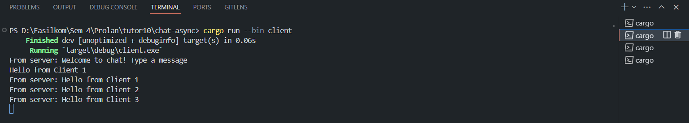
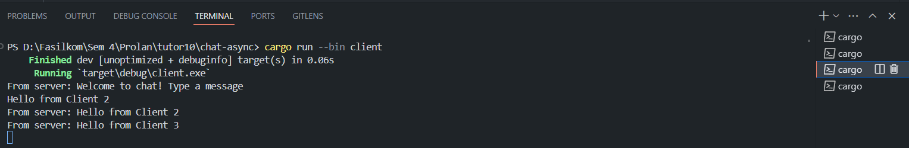
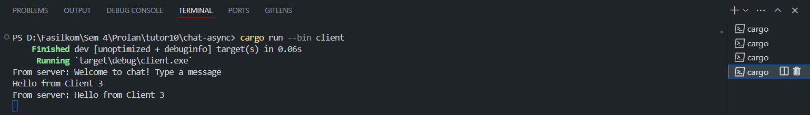
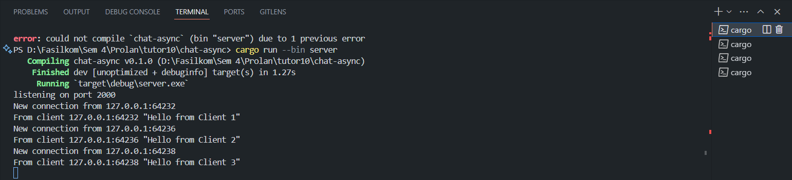

# Tutorial 10 chat-async

## 2.1 Original code of broadcast chat

### Sending message from three clients
  

### Server receiving messages


Kita dapat menjalankan server dan client masing-masing menggunakan ```cargo run --bin server``` dan ```cargo run --bin client```. Kita jalankan satu run server serta tiga run client. Setiap client akan terhubung ke server melalui sebuah Websocket. Setiap client akan diminta untuk menginput suatu message. Message yang diinput tersebut nantinya akan diteruskan ke server dan server akan mengirimkannya ke semua client yang terhubung saat itu. Itulah sebabnya setiap client dapat melihat pesan-pesan yang dikirimkan oleh client lainnya. 

##  Modifying the websocket port
Untuk mengubah port menjadi 8080, pertama-tama kita perlu mengubah bagian server.rs tepatnya pada kode:
```
let listener = TcpListener::bind("127.0.0.1:2000").await?;
println!("listening on port 2000");
```
menjadi:
```
let listener = TcpListener::bind("127.0.0.1:8080").await?;
println!("listening on port 8080");
```
Hal ini berarti kita mengubah listener dari server kita menjadi port nomot 8080. Setelah itu, kita perlu merubah url port number dari ClientBuilder supaya mereka akan memilih menghubungkan ke port 8080. Hal ini dapat dirubah pada bagian:
```
let (mut ws_stream, _) =
        ClientBuilder::from_uri(Uri::from_static("ws://127.0.0.1:2000"))
            .connect()
            .await?;
```
menjadi:
```
let (mut ws_stream, _) =
        ClientBuilder::from_uri(Uri::from_static("ws://127.0.0.1:8080"))
            .connect()
            .await?;
```
Websocket protocol yang digunakan di program ini tetap menggunakan ```tokio_websockets``` yang umum digunakan dalam app berbasis tokio. Selama masih menggunakan  ```tokio_websockets```, maka Websocket yang digunakan akan sama.

## 2.2 Small changes. Add some information to client
### Server
.png)
### Client
.png)
.png)
.png)
Pada bagian ini, kita ingin secara detail memberikan informasi tambahan mengenai siapa yang mengirim message tersebut. Hal ini dapat dilakukan dengan memodifikasi bagian pada server.rs yaitu pada:
```
bcast_tx.send(format!("{addr} : {text}"))?;
```
Pesan yang akan ditampilkan di server sekarang juga akan menampilkan dari port mana message tersebut dikirim. Pesan tersebut juga akan di - broadcast ke seluruh client yang terhubung dengan format seperti itu sehingga seluruh client dapat melihat informasi mengenai dari mana message tersebut dikirim. Aplikasi chatting pada umumnya, informasi pesan tambahannya dimodifikasi lebih lanjut seperti yang ditampilkan adalah username ataupun nomor lainnya